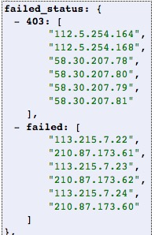

本周周报
=====

你好

本周工作如下：

- 完成go-purge-api的修改，完成新的需求
   + 结构体修改与增加（用来匹配适应新的需求）
   + 增加一个全局Map来存储需要的ip map
   + 修改了purge中的部分方法来适配需求改动（l1与l2的ip获取方式不同）

- 针对query的需求改动，进行再次修改
   + Job字段添加新的信息
   + 在Job结束时添加失败ip状态及对应的ip list
   + 测试结果 |test|

- 修改了urlfailed的上报bug
   + 移动url失败状态更新入失败逻辑
- 对第六章、第七章进行了学习
   + 对purge中utils中的NewSafeMap等有了更深的了解
   + 对不定参数进行了解

